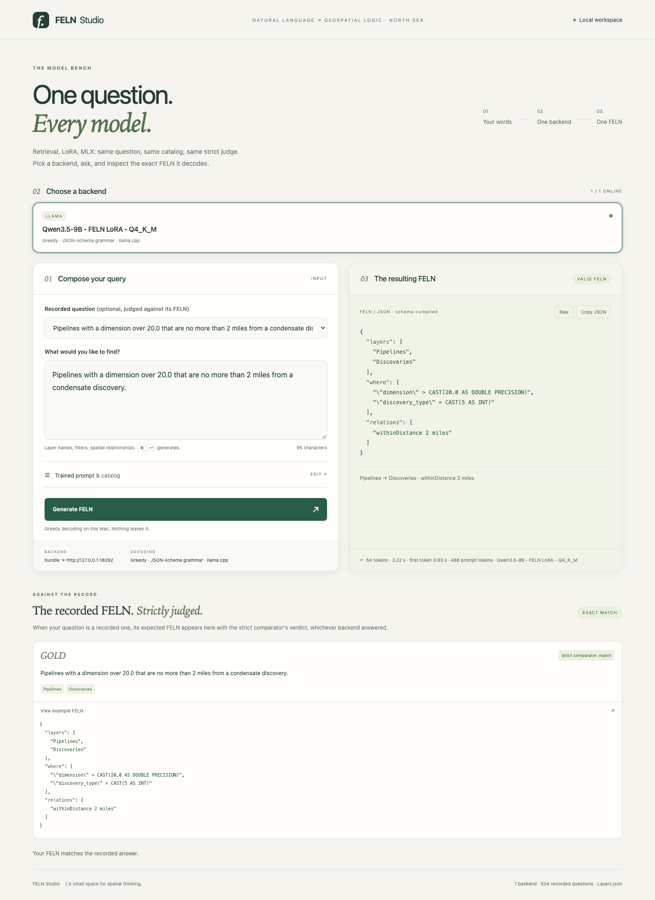

# FELN Qwen on Jetson Orin

Fine-tune Qwen to convert NorthSea geospatial questions into the application's
expected FELN JSON. Training uses the remote dual-RTX workstation; the deployed
model, application logic, and read-only spatial database run locally on Orin.
Accuracy takes priority over the original application's sub-second latency goal.

**Training and deployment walkthrough:** [How the model was fine-tuned on both RTX
GPUs, selected and exported, then deployed on Orin](docs/TRAINING_AND_DEPLOYMENT.md).
It covers data preparation, assistant-only LoRA training, checkpoint selection,
quantization, file transfer, persistent services, and the live request paths.

**Status:** trained, evaluated, and deployed; services and Mac tunnels were
subsequently stopped at the user’s request. Units remain enabled at boot. Deployment
and explicit service restart were verified before shutdown. The app/database
benchmark passed 18/18 representative held-out requests; the full model test scored 530/534.

The selected model is **Qwen/Qwen3.5-9B**, revision
`c202236235762e1c871ad0ccb60c8ee5ba337b9a`, text-only, BF16 LoRA training,
served as **GGUF Q4_K_M** with a 4,096-token context and one request at a time.
The validated GGUF is 5,629,108,640 bytes, SHA-256
`7401eb1746a82814db8e5179242c824f9c89cc9f3eca419a15b3444ec309af69`.

## Measured accuracy

Strict exact means schema-valid JSON compared with `FELN.same`, including filters,
enum values, primary layer, and spatial relations; it is not byte-for-byte formatting.

| Run | Split | Strict exact | After app compilation | Evidence |
|---|---|---:|---:|---|
| Untuned 9B, HF BF16 | Test, 534 | 69/534 (12.92%) | 100/534 (18.73%) | [Report](docs/evidence/baseline-hf-test-v6.json) |
| Tuned 9B, HF BF16 | Test, 534 | 533/534 (99.81%) | 533/534 (99.81%) | [Report](docs/evidence/tuned-hf-test-v6-bf16.json) |
| Untuned 9B Q4, Orin | Test, 534 | 96/534 (17.98%) | 129/534 (24.16%) | [Report](docs/evidence/baseline-orin-test-v6.json) |
| Tuned 9B Q4, RTX | Validation, 673 | 673/673 (100%) | 673/673 (100%) | [Report](docs/evidence/tuned-text-q4-val-v6.json) |
| Tuned 9B Q4, RTX | Test, 534 | 530/534 (99.25%) | 530/534 (99.25%) | [Report](docs/evidence/tuned-rtx-q4-test-v6.json) |
| Tuned 9B Q4, Orin | Test, 534 | 530/534 (99.25%) | 530/534 (99.25%) | [Report](docs/evidence/tuned-orin-test-v6.json) |

HF generation is unconstrained; the GGUF application path uses the original JSON
grammar. Compare matched rows when attributing an improvement. Quantization was
selected on validation, never on the test result. These are held-out synthetic/source
query families from one static catalog, not a real-user production accuracy guarantee.

## RTX versus Orin

The matched comparison uses the **same tuned GGUF and all 534 test questions**,
identical prompt and grammar, 4,096 context tokens, one slot, and sequential localhost
HTTP requests. RTX inference uses **one** RTX PRO 6000 Blackwell GPU; training used
both GPUs. Runtime build revisions differ and are recorded in the pipeline document.

| Matched tuned Q4 metric | RTX | Orin |
|---|---:|---:|
| Strict exact | 530/534 (99.25%) | 530/534 (99.25%) |
| Schema-valid | 532/534 (99.63%) | 532/534 (99.63%) |
| First request | 0.379 s | 3.079 s |
| Warm median latency | 0.402 s | 3.221 s |
| Warm p95 latency | 0.644 s | 5.168 s |
| Requests/second | 2.426 | 0.303 |
| Median generation tokens/s | 184.50 | 23.02 |
| Total test time | 220.10 s | 1,764.34 s |

All numbers in this table are **measured**. RTX is about **8× faster** for this
workload; all 534 raw output strings are identical across hosts. Evidence:
[RTX report](docs/evidence/tuned-rtx-q4-test-v6.json),
[Orin report](docs/evidence/tuned-orin-test-v6.json),
[RTX token timings](docs/evidence/rtx-tuned-runtime-metrics.json), and
[Orin token timings/output parity](docs/evidence/orin-tuned-runtime-metrics.json).
HF batch timings are not single-request HTTP latency. App/database round-trip and
shared-RAM peak are measured separately from the model endpoint.

## Orin application measurements

The full localhost request path includes Qwen, schema compilation, read-only DuckDB
spatial execution, and bounded GeoJSON. The deterministic 18-case sample covers all
nine primary-layer/layer-count strata. These numbers are **measured**:

| App metric | Result |
|---|---:|
| Exact FELN / HTTP errors | 18/18 / 0 |
| First request after service restart | 3.319 s |
| Warm median / p95 | 3.974 s / 4.931 s |
| Sequential throughput | 0.269 requests/s |
| Sampled peak system RAM used | 10.81 GB (10.06 GiB) |
| Minimum available shared RAM | 55.13 GB (51.34 GiB) |

[Benchmark evidence](docs/evidence/orin-e2e-benchmark-v6.json) includes every request
and 1,320 memory samples at 50 ms intervals. RAM is system-wide, including the OS,
app, and model; it is not dedicated GPU memory. The warm p95 has only 17 samples.
This sample differs from the 534-case model test, so subtracting their medians would
not measure database overhead. A [separate real query](docs/evidence/orin-final-request.json)
returned the expected FELN and one local GeoJSON feature in 1.791 s of server time.

## Application access

**Browser UI:** [FELN Studio](http://localhost:8766/) now runs on Orin, with a Mac
SSH tunnel started during deployment. It uses this fine-tuned Qwen model and provides
the recorded-question picker, prompt editor, generated FELN, and gold comparison.
See [Studio deployment and reconnect instructions](docs/STUDIO.md).



[Open the full-resolution screenshot](docs/images/feln-studio-orin.png), captured
from the deployed Studio on 2026-09-17 after clicking **Generate FELN**.
The query joins pipelines to condensate discoveries within two miles; the response
matches the recorded FELN. [Capture details and evidence](docs/STUDIO.md#screenshot).
Studio's legacy “on this Mac” helper text is inaccurate for this deployment:
the Mac displays the UI through SSH, while inference runs on Orin.

Installed services on the private SSH alias `orin` (currently stopped):

| Service | Unit | Loopback address |
|---|---|---|
| Studio browser UI | `feln-studio.service` | `127.0.0.1:8766` |
| FELN application and local spatial queries | `feln-qwen-app.service` | `127.0.0.1:18091` |
| Qwen model | `feln-qwen-model.service` | `127.0.0.1:18092` |

When started, the services listen only on Orin's loopback interface. To resume
the existing deployment when intended, start the three services first:

```sh
ssh orin 'sudo systemctl start feln-qwen-model.service feln-qwen-app.service feln-studio.service'
```

Then, if these local ports are free, open all three tunnels from the Mac:

```sh
ssh -N -o ExitOnForwardFailure=yes -o ServerAliveInterval=30 \
  -L 127.0.0.1:8766:127.0.0.1:8766 \
  -L 127.0.0.1:18091:127.0.0.1:18091 \
  -L 127.0.0.1:18092:127.0.0.1:18092 orin
```

Leave that terminal open, then use these URLs on the Mac:

| Service | Mac URL | Purpose |
|---|---|---|
| Studio | <http://localhost:8766/> | Browser interface |
| App API | <http://localhost:18091/health> | Model and spatial-query readiness |
| Model API | <http://localhost:18092/health> | llama.cpp readiness |

If a port is already forwarded, reuse its existing tunnel; do not start a duplicate.
The Mac runs the browser and SSH transport. Studio, inference, and database queries
run on Orin. To submit a spatial query from another Mac terminal:

```sh
curl http://127.0.0.1:18091/health
curl http://127.0.0.1:18091/query -H 'Content-Type: application/json' \
  -d '{"text":"Show all wells","limit":10}'
```

`POST /feln` returns FELN without executing it. `POST /query` additionally returns
bounded GeoJSON from the approved local database copy. No workstation tunnel is
used for inference. Concurrent requests receive HTTP 429.
Service restart evidence is [saved here](docs/evidence/orin-service-restart.txt).
A physical device reboot was not performed.

## Remaining limitations

- Four of 534 test outputs are wrong: two altered a status literal and two truncated
  a field name. [Saved failures](docs/evidence/tuned-orin-errors-v6.json).
- Accuracy covers held-out synthetic/source query families from the fixed NorthSea
  catalog. New catalogs and real-user language need a separate evaluation.
- Single-request concurrency; complete Orin responses exceed one second. The app
  exposes HTTP endpoints and reuses the original core. Studio adds a generation UI;
  map execution is not implemented in Studio.
- Spatial distances use the reference app's regional EPSG:32632 approximation.
  Fine-tuned larger-model accuracy and physical-device reboot recovery were not tested.

## Code and documentation

- [Privacy and local configuration](docs/CONFIGURATION.md): removed identifiers,
  environment variables, SSH aliases, local service-account overrides, and remaining
  private history/artifacts. Start with [`.env.example`](.env.example).

- [`training/`](training): immutable data preparation, LoRA training, strict evaluation,
  and text-only GGUF export. The final split has 4,790 train / 673 validation / 534 test
  records, with provenance and disjoint query families.
- [`serving/`](serving): a thin HTTP adapter reusing pinned `feln-lora` application
  code, systemd units, and the end-to-end benchmark.
- [Pipeline and measured evidence](docs/PIPELINE.md): hardware, model selection,
  transformations, training, results, and limitations.
- [Training-to-deployment walkthrough](docs/TRAINING_AND_DEPLOYMENT.md): detailed
  explanation of the Mac, dual-RTX workstation, and Orin workflow, with commands
  and saved artifact locations.
- [Commands and operations](docs/COMMANDS.md): reproduction, service management,
  troubleshooting, and rollback.
- [Lessons learned](docs/LESSONS.md): observed failures, fixes, and verification gates.

NorthSea originals and sibling repositories remain untouched. Runtime artifacts and
failed attempts are retained outside Git; documentation and evidence are committed.

## Contributing

Fork the repository and submit a pull request. The repository owner reviews and
merges changes; direct pushes to `main` are blocked. See [CONTRIBUTING.md](CONTRIBUTING.md).

## Acknowledgements

A huge thank you to **[Geodata](https://www.geodata.no/)** for the beautiful
**NorthSea data** that made this project possible! It brings the training,
evaluation, and Studio demonstrations to life with rich, real-world geospatial
examples. We deeply appreciate the work and care behind this dataset.

## License

Original code and documentation in this repository are licensed under the
[Apache License 2.0](LICENSE). Third-party dependencies, model weights, source
datasets, and reproduced data retain their respective licenses and terms.
