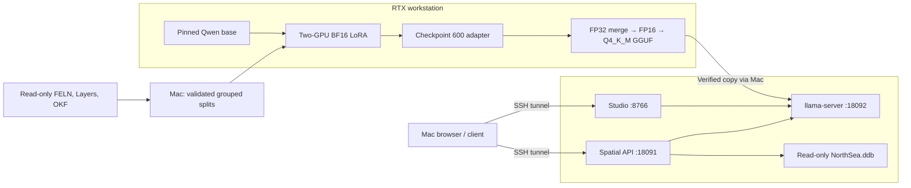

# How the model was fine-tuned on RTX and deployed on Orin

Host identities and private paths are sanitized. Load the host-specific variables
and configure the SSH aliases described in [Local configuration](CONFIGURATION.md)
before using these commands. The service account in checked-in units is a placeholder;
configure its local drop-in after copying the units and before starting them.

This walkthrough describes the completed NorthSea run: what the model learned, how
the two RTX GPUs were used, how the winning checkpoint became a GGUF, and how the
model, spatial API, and Studio run on Orin. Recorded results are **measured** unless
explicitly labeled as estimates. Configuration values describe the actual run.

The selected base and tokenizer are **Qwen/Qwen3.5-9B**, both pinned to revision
`c202236235762e1c871ad0ccb60c8ee5ba337b9a`. Training uses the text-only
`Qwen3_5ForCausalLM` class. The deployed model is the merged fine-tune in
**GGUF Q4_K_M** format. `RTX-Qwen` was not a defined model in the application.

## 1. The role of each machine

| Machine | Work performed | Workspace |
|---|---|---|
| Mac | Inspect sources, build and validate data, author code, orchestrate SSH/SCP, use Studio through a tunnel | `feln-qwen` checkout |
| RTX workstation | Download the base, run smoke and full LoRA training, score checkpoints, merge/export/quantize, benchmark | `/opt/dlami/nvme/feln-qwen-20260917` |
| Orin | Prove stock inference before training, evaluate the final GGUF, run the model, spatial API, database, and Studio | `/data/feln-qwen-20260917` and `/data/feln-studio-20260917` |

The workstation was accessed with:

```sh
ssh rtx-training
```

Orin was accessed with `ssh orin` (account and address redacted). SSH keys stayed on
the Mac. Training never ran on Orin; production inference never calls the workstation.



Measured hardware changed the training choice. The workstation actually has two
**RTX PRO 6000 Blackwell Server Edition** GPUs with **97,887 MiB each**, plus
536,562,638,848 bytes of system RAM. Orin has 65,932,554,240 bytes of shared RAM.
These were checked by commands, not inferred from names. See the
[RTX inventory](evidence/workstation-inventory.txt) and
[Orin inventory](evidence/orin-inventory.txt).

## 2. What the fine-tune learned

The task is natural language → the application's FELN JSON contract. A response
contains aligned `layers` and `where` arrays, plus spatial `relations` from the
primary `layers[0]` to each subsequent layer. Correctness requires the right primary
layer, field names, typed enum codes, SQL literals, predicates, and relation direction.

For example, the recorded question shown in the [Studio screenshot](STUDIO.md#screenshot)
asks for pipelines with dimension greater than 20 within two miles of a condensate
discovery. Its target is:

```json
{
  "layers": ["Pipelines", "Discoveries"],
  "where": [
    "\"dimension\" > CAST(20.0 AS DOUBLE PRECISION)",
    "\"discovery_type\" = CAST(5 AS INT)"
  ],
  "relations": ["withinDistance 2 miles"]
}
```

Training reused the pinned `feln-lora` schema and prompt code rather than inventing
a generic chat format. The tokenizer renders a system instruction with the catalog,
the user's question, and the assistant prefix, with thinking disabled. The target is
the JSON serialization of the expected FELN followed by the tokenizer's EOS token.
Prompt labels are masked with `-100`, so loss is calculated only on the assistant's
JSON and EOS. Examples longer than 2,048 tokens fail instead of silently truncating
the answer. Padding labels are also ignored by the data collator.

The reference application revision is
`6d5ad2650ea5b86cd0a92e75075dd2b04555a787`; its `src.prompt.build_dataset` is called
from [the training script](../training/train.py). The FELN comparator dependency is
pinned to `b42696ee1c84d114c446fab0879008e305844e22`.

## 3. How the training data was prepared

[prepare.py](../training/prepare.py) reads the original NorthSea directory without
modifying it. Derived files go into `runs/data-20260917-v6` and the corresponding
new remote directories. The three inputs have different jobs:

| Source | Contribution |
|---|---|
| `FELN.json` | 1,000 existing question/FELN records and their source-text paraphrases |
| `Layers.json` | The application's authoritative layer names, fields, SQL types, enum mappings, and hints |
| `okf/` | Verified aliases, domain/sample values, and explanatory schema information used to create additional examples |

The builder validates and compiles labels using the application schema, generates
3,600 spatial questions plus supported field/domain examples, and records the source
file, original record or Markdown line, generator index, seed, and each label's
before/after transformation. Seven OKF-only Wells fields are excluded because the
app catalog cannot serve them. Conflicting labels fail validation. Duplicate questions
merge their provenance; **149 duplicates were removed**.

Related examples stay in one split. Group keys normalize literals, typed SQL casts,
secondary-layer order, distance-unit variants, and `inside`/`within` aliases while
preserving the primary layer and positive versus negative spatial predicates.
Independent checks reject overlapping normalized text, families, or canonical FELN
targets. All nine primary-layer/layer-count strata are represented.

| Final split | Measured records | Purpose |
|---|---:|---|
| Train | 4,790 | Update LoRA parameters |
| Validation | 673 | Select checkpoint and verify export/quantization |
| Test | 534 | Report held-out accuracy and performance |

There are **3,393 families**. The earlier v5 split missed distance-unit grouping;
that early training attempt was stopped. Final v6 was rebuilt and trained from the
stock base, not resumed from v5. The schema is shared across splits deliberately:
this tests unseen query combinations within NorthSea, not a new catalog.
See [the build manifest](evidence/data-build-v6.txt),
[contract checks](evidence/contract-check-v6.txt), and
[verification on the staged copies](evidence/staged-data-verification.txt).

The prepared directory and pinned application/FELN source archives were staged on
the workstation. `prepare.py --verify` checked the copied dataset before training.
`NorthSea.ddb` is used for local spatial execution and validation of reference queries;
it is not a database connection needed by the training loop. Source preparation and
archive commands are in [COMMANDS.md](COMMANDS.md#prepare-and-check-mac).

## 4. How both RTX GPUs performed the fine-tuning

The existing environment `${TRAIN_VENV}` was used read-only:
PyTorch **2.10.0+cu130**, Transformers **5.15.1**, PEFT **0.20.0**, and Accelerate
**1.11.0**. The installed CUDA compiler reported **13.2.51**; PyTorch reported its
own CUDA build as **13.0**. These are separate version readings. No shared packages
or drivers were replaced. [Runtime evidence](evidence/workstation-runtime.txt) and
[complete package snapshot](evidence/training-packages.json).

LoRA freezes the base weights and learns small low-rank updates to its linear
layers. BF16 LoRA was chosen because the measured GPUs comfortably fit the 9B
base and activations. QLoRA/NF4 was unnecessary for this capacity. The four-bit
quantization used for deployment happens later; training did not use four-bit weights.

`torchrun --nproc_per_node=2` starts one process per GPU. Each process selects its
`LOCAL_RANK`, loads a complete model replica, and trains on its share of the data.
Distributed data parallel synchronizes trainable gradients. The model is replicated
across the GPUs, not split into two halves. Each GPU handles two examples per
microbatch, with four accumulation steps: the nominal effective batch is
**2 × 4 × 2 = 16 examples per optimizer step**.

| Training setting | Actual configuration |
|---|---|
| LoRA rank / alpha / dropout | 32 / 64 / 0 |
| Target modules | `all-linear` on the text model |
| Base precision | BF16 |
| Optimizer | Fused AdamW, weight decay 0, gradient norm limit 1.0 |
| Learning rate | 0.0002, cosine schedule |
| Warmup | 30 optimizer steps for the full run |
| Duration | Two epochs; 600 completed optimizer steps |
| Sequence limit | 2,048 tokens; reject overlength examples |
| Memory controls | Non-reentrant gradient checkpointing; training KV cache disabled |
| Reproducibility | Seed and data seed 20260917 |
| Checkpoint/evaluation schedule | Every epoch; retain both checkpoints |
| Selection | Lowest validation loss; load best checkpoint before saving the final adapter |

The full configuration is saved in the [run report](evidence/full-v6-report.json)
and [adapter configuration](evidence/adapter-config.json). There was no automated
hyperparameter sweep. “Tuning” here means this supervised LoRA run, validation-based
checkpoint selection, and validation of the serving precision. No single-GPU training
baseline was measured, so no two-GPU training speedup is claimed.

### Smoke run, then the full run

Before full training, stock Qwen inference and a real app/database query had already
worked on Orin. This established runtime compatibility independently of fine-tuning.
[Stock inference evidence](evidence/orin-stock9-inference.txt) and
[stock app request](evidence/orin-app-stock-e2e-v2.json).

On RTX, after verifying the GPUs were available:

```sh
cd /opt/dlami/nvme/feln-qwen-20260917
export PYTHONPATH=$PWD/app:$PWD/feln

"${TRAIN_VENV}/bin/torchrun" --standalone --nproc_per_node=2 \
  training/train.py --base base --data data-20260917-v6 --output smoke-v6 --smoke \
  > smoke-v6.log 2>&1

"${TRAIN_VENV}/bin/torchrun" --standalone --nproc_per_node=2 \
  training/train.py --base base --data data-20260917-v6 --output full-v6 \
  > full-v6.log 2>&1
```

These are the recorded run names, not instructions to overwrite them. For a new
experiment, use fresh output directories and log names. The base directory is the
pinned Hugging Face snapshot; its exact download command is in
[the command reference](COMMANDS.md#train-rtx).

The smoke run used the first 32 train and 32 validation records, four optimizer
steps, and one warmup step. It completed in **30.4099 seconds**. The full run then
completed training and adapter saving in **3,500.0459 seconds**, approximately
**58.33 minutes**, with train loss **0.0142053**. Rank-0 PyTorch peak allocated memory
was **25,594,151,424 bytes** and peak reserved memory was **50,342,133,760 bytes**;
these are allocator readings for rank 0, not a sum across GPUs. The longest observed
sequences were 924 train tokens and 869 validation tokens.
[Smoke report](evidence/smoke-v6-report.json), [full report](evidence/full-v6-report.json).

## 5. How the checkpoint and serving precision were selected

| Saved checkpoint | Measured validation loss | Decision |
|---|---:|---|
| `full-v6/checkpoint-300` | 0.0027208291 | Retained |
| `full-v6/checkpoint-600` | 0.0009413157 | Selected |

The Trainer restored checkpoint 600 and saved `full-v6/adapter`. Validation loss
is teacher-forced token loss, not the percentage of generated FELN answers that
are correct. Separate generation evaluations are required. The full training
history and selection are in [trainer state](evidence/full-v6-trainer-state.json).

[evaluate.py](../training/evaluate.py) runs the real prompt and measures schema
validity, strict raw FELN equality, and equality after the application compiler.
Equality uses `FELN.same`, preserving semantics rather than requiring identical
JSON whitespace. Every prediction retains its expected answer, provenance, and timing.

The HF adapter scored **672/673** on validation and **533/534** on test. Evaluation
needed BF16 autocast because the existing environment failed an isolated FP32 CUDA
matrix multiplication; no environment upgrade was made. On the workstation the
corrected evaluator is named `training/evaluate-v2.py`, corresponding to this
repository's `training/evaluate.py`.
[Validation report](evidence/tuned-hf-val-v6-bf16.json),
[test report](evidence/tuned-hf-test-v6-bf16.json), and [failure/fix](LESSONS.md#match-evaluation-precision-to-training).

After export, Q4_K_M scored **673/673** exact on validation and was selected before
running its held-out test. Q8 was not needed to pass this validation check. The
GGUF path includes JSON-schema grammar, while HF evaluation is unconstrained;
the result does not isolate quantization from runtime and decoding differences.
[Quantized validation](evidence/tuned-text-q4-val-v6.json).

## 6. How the adapter became the Orin model

The LoRA adapter is not served as a separate runtime attachment. On the workstation,
[export.py](../training/export.py) loads the base on CPU in FP32, merges the selected
LoRA weights, then writes an FP16 text-only Hugging Face model. It also exports the
tokenizer and exact application bundle: `inference_config.json` contains the prompt
prefix/suffix, maximum output length, and JSON schema; `Layers.json` preserves the
catalog used during training.

The first conversion exposed a text-only export issue: inherited metadata advertised
an optional MTP predictor that was not present in the exported class. The corrected
export sets `mtp_num_hidden_layers=0`, and the converter also requires `--no-mtp`.
Both fixes are necessary. The failed GGUF and interrupted copies remain preserved;
only the corrected artifact was selected.

The actual corrected commands on RTX were:

```sh
CUDA_VISIBLE_DEVICES="" OMP_NUM_THREADS=8 \
  "${TRAIN_VENV}/bin/python" training/export-v2.py \
  --base base --adapter full-v6/adapter --schema data-20260917-v6/Layers.json \
  --output merged-v6-mtp0

CUDA_VISIBLE_DEVICES="" "${LLAMA_CPP_DIR}/.venv-convert/bin/python" \
  "${LLAMA_CPP_DIR}/convert_hf_to_gguf.py" merged-v6-mtp0 \
  --outfile tuned-v6-text-f16.gguf --outtype f16 --no-mtp

"${LLAMA_CPP_DIR}/build/bin/llama-quantize" \
  tuned-v6-text-f16.gguf tuned-v6-text-q4_k_m.gguf Q4_K_M
sha256sum tuned-v6-text-q4_k_m.gguf
```

`export-v2.py` is the preserved remote name for the repository's corrected
`training/export.py`. Conversion/quantization used llama.cpp revision
`b29c606e28a01b1bc8c1351026a0fa6e616bf6c4`. The resulting GGUF is
**5,629,108,640 bytes**, with SHA-256:

```text
7401eb1746a82814db8e5179242c824f9c89cc9f3eca419a15b3444ec309af69
```

[Export identity and validation evidence](evidence/tuned-text-export-v6.json).

## 7. Transfer and installation on Orin

The model was transferred through the Mac using SCP; the workstation's SSH key was
not copied to Orin. The completed transfer command was:

```sh
scp -3 -o ServerAliveInterval=30 \
  rtx-training:/opt/dlami/nvme/feln-qwen-20260917/tuned-v6-text-q4_k_m.gguf \
  orin:/data/feln-qwen-20260917/tuned-v6-text-q4_k_m.gguf
ssh orin 'sha256sum /data/feln-qwen-20260917/tuned-v6-text-q4_k_m.gguf'
```

The full size and SHA-256 were verified before loading. A new `model.gguf` symlink
points to this selected file. The prompt bundle and catalog hashes also match the
RTX export. Pinned application sources, a dedicated Python environment, and the
explicitly approved `NorthSea.ddb` copy live under the Orin workspace. The database
is opened read-only and its before/after hash remains unchanged.
[Artifact verification](evidence/orin-final-artifact-installed.txt) and
[final service/database verification](evidence/orin-final-verification.txt).

Orin uses its existing CUDA-enabled
`/data/src/llama.cpp/build/bin/llama-server`, revision
`434ddbbc0e30522e897670681e503b797c12b7c1`. Measured platform versions are L4T R39.2.1
and CUDA compiler 13.2.86; no JetPack metapackage label was inferred. No NVIDIA
libraries, power settings, boot settings, or unrelated services were changed.

The model unit launches:

```sh
/data/src/llama.cpp/build/bin/llama-server \
  -m /data/feln-qwen-20260917/model.gguf \
  -c 4096 -np 1 -ngl 99 --host 127.0.0.1 --port 18092 --no-webui
```

The context is 4,096 tokens, with one slot and all model layers offloaded. The
application bundle limits generation to 512 tokens. The initial memory plan was
an **estimate of 15.5 GiB**, covering weights, quantization metadata, attention KV
cache, recurrent state, runtime buffers, application memory, and safety margin.
The later app benchmark measured **10.81 GB total system RAM used at its sampled
peak**, leaving **55.13 GB available**. These are system-wide shared-memory readings,
not dedicated VRAM. The complete budget and model-size rationale are in
[PIPELINE.md](PIPELINE.md#model-selection-and-memory-budget).

## 8. The three persistent services and the live request paths

All three are system services running as the deployment service account (name redacted) and bound to loopback:

| Service | Port | What it does | Configuration |
|---|---:|---|---|
| `feln-qwen-model.service` | 18092 | Loads the GGUF and generates FELN text | [Unit](../serving/feln-qwen-model.service) |
| `feln-qwen-app.service` | 18091 | Reuses the pinned app schema/client and executes spatial queries against the local database | [Unit](../serving/feln-qwen-app.service) |
| `feln-studio.service` | 8766 | Serves the browser playground and judges recorded questions | [Unit](../serving/feln-studio.service) |

The spatial API runs in its isolated Python 3.12 environment. Studio runs in a
separate private Python 3.13.15 environment because of its package requirement.
Studio source is pinned to `03123e49fca9f80f42b3ee1b0f0dde39ca9bd2ef`, with only
its existing GGUF backend enabled. Its model URL is the same local port 18092;
`--start` is not used, so Studio does not load a second model. Its full installation
and dependency commands are in [STUDIO.md](STUDIO.md).

For a browser request, the Mac sends HTTP through SSH to Studio on Orin. Studio
renders the trained prompt, calls the local model, parses and compiles the result,
and compares it with the expected FELN when the question is recorded. It returns
JSON to the browser for display. There is no RTX request in this path.

For `POST /query`, the spatial API performs generation and compilation, executes
the result through the original read-only DuckDB spatial planner, and returns
bounded GeoJSON. `POST /feln` returns FELN without spatial execution. Studio's map
UI is not implemented; its current UI is for generation and inspection.

The new unit files were installed without replacing existing services, followed by
`systemctl daemon-reload` and `systemctl enable --now`. Explicit restarts changed
the relevant PIDs, health checks passed, and subsequent requests succeeded. Studio
was deployed later and its restart did not restart the model or spatial API.
[Model/app restart](evidence/orin-service-restart.txt),
[Studio restart](evidence/studio-deployment.txt). Boot activation is configured;
a physical device reboot was not tested. See [operations and rollback](COMMANDS.md#operations-troubleshooting-rollback)
and [Mac access URLs/tunnels](../README.md#application-access).

## 9. What was measured after deployment

The final GGUF was tested on all 534 held-out questions on Orin, not merely assumed
to match the HF adapter. It produced **530/534 exact answers (99.25%)**, versus
**96/534 (17.98%)** for the controlled untuned Orin Q4 baseline. The HF fine-tune had
533/534, so the deployment path has three additional test errors despite its perfect
validation score. All four deployment errors are retained and documented.
[Baseline](evidence/baseline-orin-test-v6.json), [final artifact](evidence/tuned-orin-test-v6.json),
[errors](evidence/tuned-orin-errors-v6.json).

For the RTX/Orin comparison, the same GGUF, questions, prompt, grammar, context,
and single-request settings were used. RTX inference used **one GPU**, unlike
two-GPU training. Runtime builds differed. All 534 raw output strings were identical.

| Measured model HTTP metric | One RTX GPU | Orin |
|---|---:|---:|
| Exact FELN | 530/534 | 530/534 |
| Warm median latency | 0.402 s | 3.221 s |
| Warm p95 latency | 0.644 s | 5.168 s |
| Sequential requests/s | 2.426 | 0.303 |

[RTX report](evidence/tuned-rtx-q4-test-v6.json),
[Orin report](evidence/tuned-orin-test-v6.json), and
[output parity](evidence/orin-tuned-runtime-metrics.json).

The separate app/database benchmark passed **18/18** with zero HTTP errors,
**3.974 s** warm median, **4.931 s** warm p95, and **0.269 requests/s**. It sampled
shared memory every 50 ms over 1,320 samples. Studio then passed nine representative
requests through the Mac tunnel, followed by a real browser selection/Generate
interaction captured in the screenshot. These are separate measurements, not
interchangeable latency samples.
[App benchmark](evidence/orin-e2e-benchmark-v6.json),
[Studio integration](evidence/studio-integration.json),
[browser capture](evidence/studio-screenshot.json).

The temporary RTX inference server was stopped and both GPUs were idle while Orin
continued serving. [Workstation release evidence](evidence/rtx-final-idle.txt).
Accuracy is prioritized over sub-second Orin responses. Results cover held-out
synthetic/source query families from a fixed catalog, not independently collected
real-user questions or unseen catalogs.

## 10. Where to find the saved work

| Artifact | Location |
|---|---|
| Reproducible source, units, documentation, screenshot, result summaries | This private Git repository |
| Validated local splits and pinned source archives | Mac `runs/data-20260917-v6` and `runs/reference` |
| Base model and tokenizer | RTX workspace `base/` |
| Training logs | RTX workspace `smoke-v6.log`, `full-v6.log` |
| Both full checkpoints, optimizer state, and Trainer history | RTX workspace `full-v6/` |
| Selected adapter and tokenizer | RTX workspace `full-v6/adapter/` |
| Merged FP16 export and prompt bundle | RTX workspace `merged-v6-mtp0/` |
| Full evaluations, expected records, and per-question predictions | Named evaluation directories in the RTX and Orin workspaces |
| Selected deployed model | Orin workspace `tuned-v6-text-q4_k_m.gguf`, linked as `model.gguf` |
| Application bundle, local database, and logs | Orin workspace `bundle/`, `NorthSea.ddb`, `logs/` |
| Studio source, runtime, and logs | `/data/feln-studio-20260917/{app,venv,logs}` |

The adapter is 346,294,736 bytes, with SHA-256
`e60a7c4abe38383c0e6d3e3f6525779242fef8dd4d0a6e1a6842741bfdd7a76b`.
Model weights, full datasets, checkpoints, and virtual environments are not stored
in Git. A clone supplies the implementation and evidence; reproduction also needs
the authorized NorthSea sources and the pinned model snapshot. Failed attempts and
earlier artifacts remain preserved in their distinct work directories.

Use [COMMANDS.md](COMMANDS.md) for operational commands,
[PIPELINE.md](PIPELINE.md) for the complete inventory and experiment evidence, and
[LESSONS.md](LESSONS.md) for the observed data, precision, export, and service issues.
